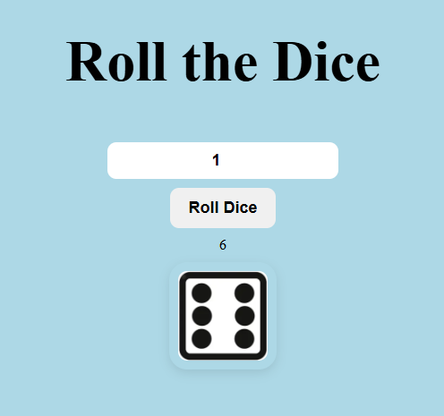
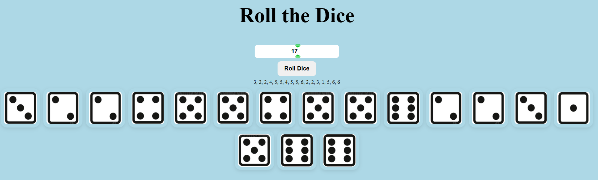
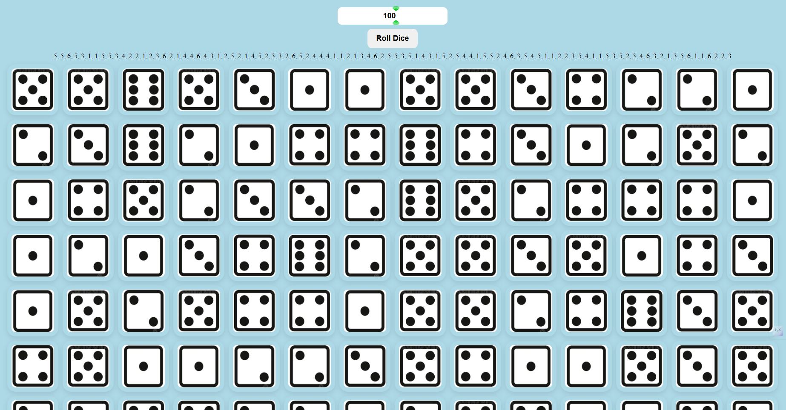

# Roll Dice

This project is a simple dice rolling simulator. It allows you to roll a specific number of dice and displays the result on the screen. The dice images are also displayed on the screen. The user can enter the number of dice they want to roll and click the "Roll Dice" button to see the result. The result is displayed in the "Result" section below the "Roll Dice" button. The dice images are displayed in the "Dice Images" section below the "Result" section. The user can click the "Roll Dice" button multiple times to roll different sets of dice.

## Screenshots:

- 
- 
- 

**note:** Don't increase the number of dice too much, it will take a lot of time to load and some times it will crash the browser.
