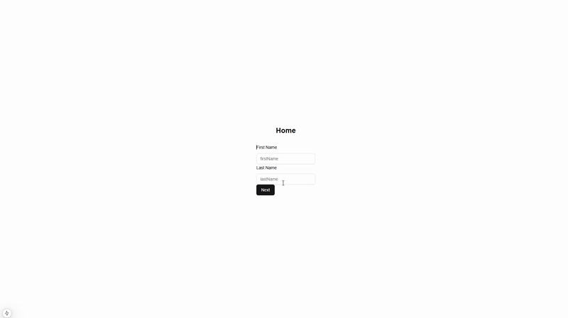

# Multi-Step Form with Zustand

This is a multi-step form built using zustand with persistent state. It is built using Next.js, Zustand, and TailwindCSS. It keeps record of the user's progress and allows them to navigate between steps.

## Preview



## Features

- Persistent state using Zustand
- Form validation using zod
- Can not navigate by skipping steps
- Profile information after form submission

## Getting Started

First, run the development server:

```bash
npm run dev
# or
yarn dev
# or
pnpm dev
# or
bun dev
```

Open [http://localhost:3000](http://localhost:3000) with your browser to see the result.

You can start editing the page by modifying `app/page.tsx`. The page auto-updates as you edit the file.