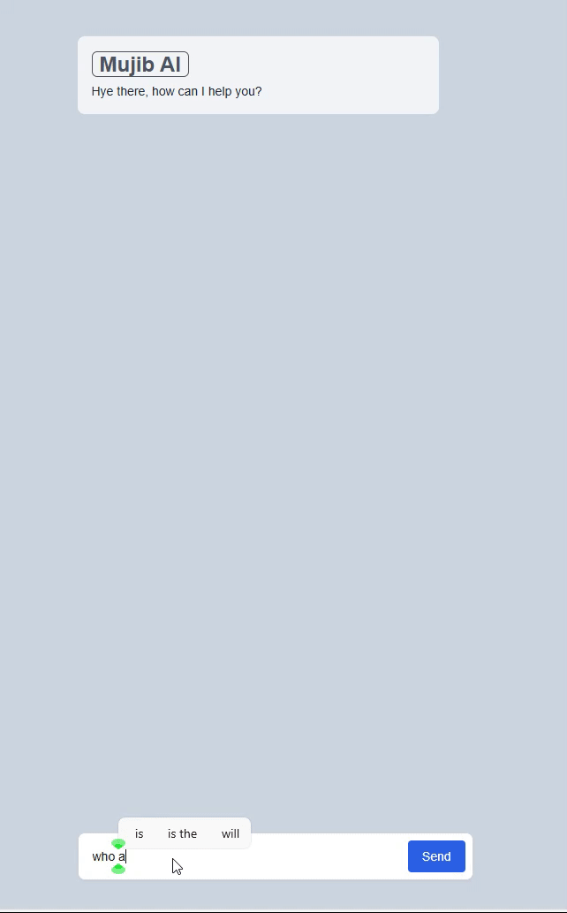

# Mujib Ai

Mujib AI is a chatbot that uses AI to answer your questions. It is powered by Groq models.

## Screenshots

This version uses **gemma2-9b-it** model but you can change the model in `/api/chat/route.ts`

- 

## To use Mujib AI

1. Clone the repository
2. Install dependencies using `pnpm install`
3. add `.env` file
4. Run `pnpm dev`
